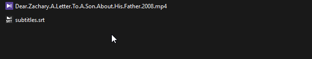
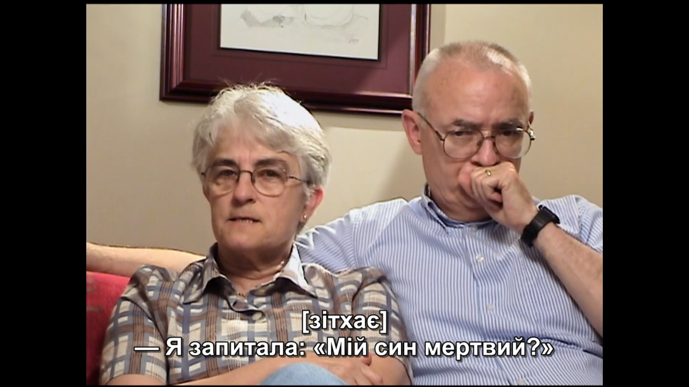
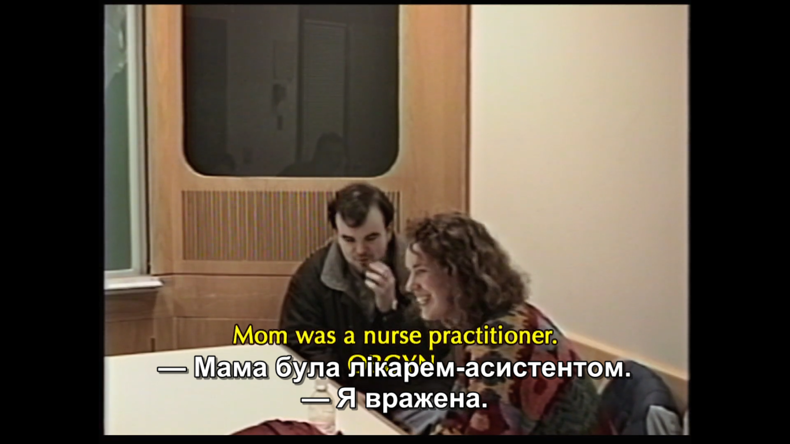
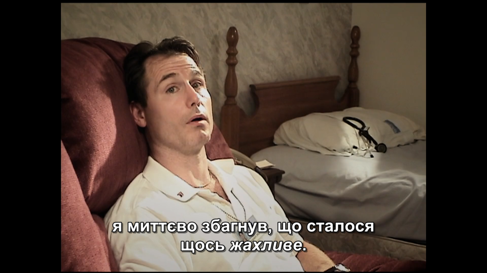
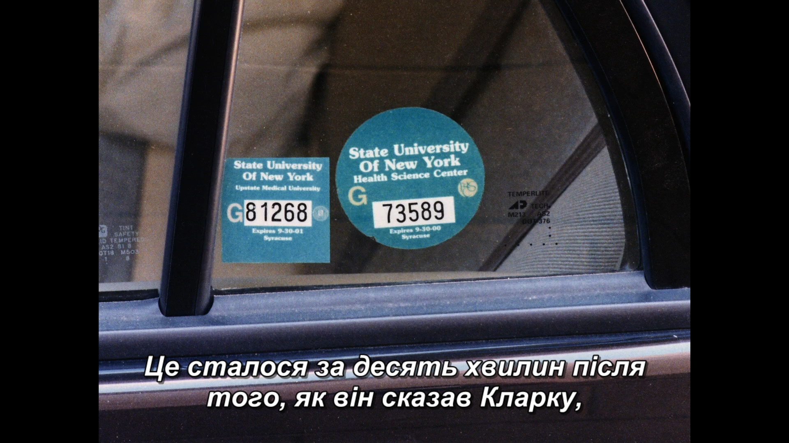

# Dear Zachary — Ukrainian subtitles / Українські субтитри

## 🇺🇦 Українська

### Про переклад

- **Статус:** ✅ Завершено (100%)
- **Кількість рядків:** ~ 3000
- **Кількість слів:** 15,718
- **Витрачений час:** Місяць
- **Останнє оновлення:** 01.08.2026

### Завантаження

Файл субтитрів: [`subtitles.srt`](subtitles.srt)

### Встановлення

1. Завантажте файл `subtitles.srt`.
2. Перейменуйте його так, щоб назва точно збігалася з назвою відеофайлу (наприклад, `movie-name.srt` для `movie-name.mkv`), і покладіть в ту саму папку — більшість плеєрів (VLC, MPC-HC, KMPlayer тощо) підхоплять субтитри автоматично.
   - Або підключіть файл вручну через меню плеєра (наприклад, у VLC: `Subtitle → Add Subtitle File...`).
3. Файл у кодуванні UTF-8 — це важливо для коректного відображення українських символів (зокрема "ї", апострофа тощо). Якщо плеєр показує "кракозябри", перевірте, що кодування субтитрів примусово не перевизначене на щось інше (напр. Windows-1251).

### Приклад перейменування

### Скріншоти

### Ліцензія

Цей переклад поширюється за ліцензією [CC BY-NC-ND 4.0](../../../LICENSE). Використання дозволене лише некомерційне, з обов'язковим зазначенням автора перекладу та посиланням на репозиторій.

---

## 🇬🇧 English

### About this translation

- **Status:** ✅ Complete (100%)
- **Lines translated:** ~ 3000
- **Words translated:** 15,718
- **Time spent:** A month
- **Last updated:** 01.08.2026

### Download

Subtitle file: [`subtitles.srt`](subtitles.srt)

### Installation

1. Download the `subtitles.srt` file.
2. Rename it to exactly match your video file's name (e.g. `movie-name.srt` for `movie-name.mkv`) and place it in the same folder — most players (VLC, MPC-HC, KMPlayer, etc.) will pick it up automatically.
   - Alternatively, load it manually via the player's menu (e.g. in VLC: `Subtitle → Add Subtitle File...`).
3. The file is UTF-8 encoded — this matters for correctly displaying Ukrainian-specific characters (e.g. "ї", the apostrophe). If your player shows garbled text, check that the subtitle encoding isn't being forced to something else (e.g. Windows-1251).

### Renaming example

### Screenshots

### License

This translation is released under [CC BY-NC-ND 4.0](../../../LICENSE). Non-commercial use only, with mandatory attribution to the translator and a link back to the repository.